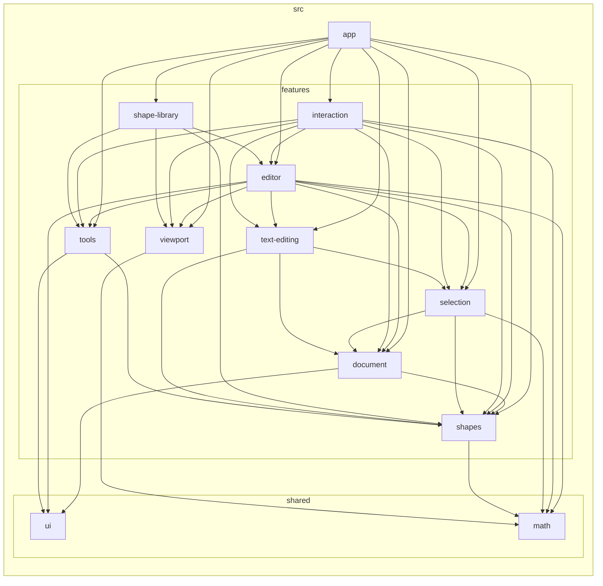
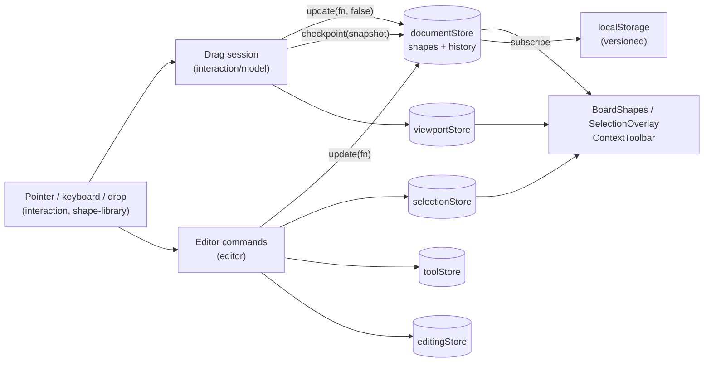

# Architecture

This page is a map. For the reasoning behind these choices, see `docs/adr/`. For the store rules, see `docs/architecture/state.md`.

## Layers

```
src/
├── main.tsx            entry: global styles + <Whiteboard/>
├── app/                composition root (Whiteboard, BoardShapes, ShortcutHint)
├── features/<name>/    self-contained slices, public API = index.ts
└── shared/             feature-agnostic: math/, ui/, styles/
```

Features from lowest to highest. A feature may import only features listed above it:

| Level | Features |
|---|---|
| 1 | `shapes`, `viewport` (only `shared`) |
| 2 | `document`, `tools` |
| 3 | `selection` |
| 4 | `text-editing` |
| 5 | `editor` (cross-store commands) |
| 6 | `shape-library`, `interaction` |
| — | `app` composes everything |

## Dependency graph (generated)

Run `npm run graph` to refresh this graph. Do not edit it by hand.

<!-- graph:start -->



<!-- graph:end -->

## Component tree

```
Whiteboard (app)
├── Canvas (viewport)               dot grid + camera-transformed world layer; wheel pan/zoom
│   ├── BoardShapes (app)           ShapeView (shapes) ×N, TextEditor (text-editing) for the edited shape
│   ├── SelectionOverlay (selection) frame, resize handles, rotate knob
│   └── MarqueeBox (selection)
├── TopBar (document)               brand, BoardTitle, undo/redo
├── Toolbar (tools)                 select / hand / text / arrow / library toggle
├── ShapeLibrary (shape-library)    StickyNotePicker + ShapeGrid (click or drag)
├── ContextToolbar (editor)         floats above the selection: colors, duplicate, order, delete
├── ZoomControls (viewport)
└── ShortcutHint (app)
```

## Data flow



- **Pure core:** `shapes/model/shapeOps.ts` computes every shape change. Stores only apply its results.
- **Gestures** start from a snapshot, recompute the preview on each move and commit one undo step when released.

## Coordinate systems

- **World:** where shapes live. 1 unit = 1 CSS px at 100% zoom.
- **Screen:** pixels relative to the canvas element.
- `screen = (world + camera.xy) × camera.z`. The whole world layer is a single CSS transform
  `scale(z) translate(x, y)` (ADR 0005). Convert with `screenToWorld` / `worldToScreen` from `@/features/viewport`.
- Selection chrome sizes are divided by zoom so they stay a constant size on screen.

## Rendering model

Each shape is an absolutely positioned `div` containing an SVG outline and an HTML label (ADR 0002). The browser
therefore handles text layout, editing and hit-testing. The DOM hooks are `data-shape-id` on shapes,
`data-handle` on handles (`n`…`sw`, `rotate`, and `start`/`end` on a selected connector) and `data-text-editor` on the editor.
Connectors (arrows) are `kind: 'connector'` shapes drawn by `ConnectorView` as an SVG line (ADR 0008).
